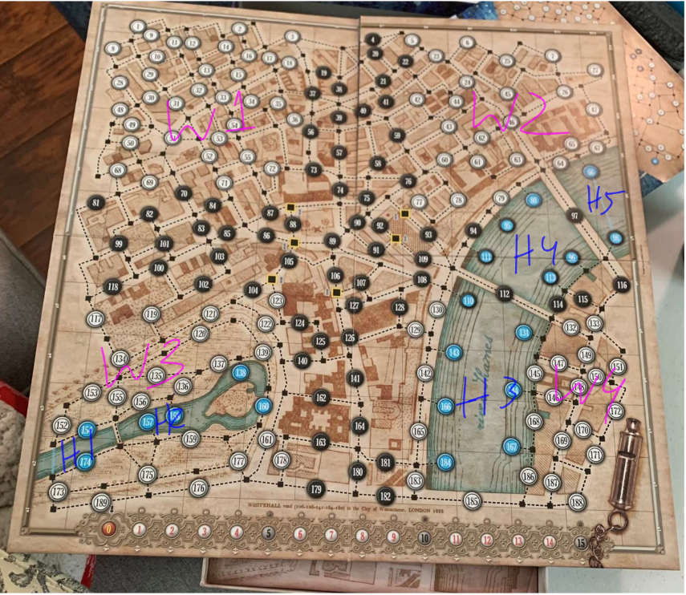

# mystery-ai
Inclusive Coding Festival Project: Using AI to play a hidden movement board game  
Based off of *Whitehall Mystery* by Fantasy Flight Games.

## How the Game, *Whitehall Mystery*, works
*Whitehall Mystery* is a game about three investigators, Jasper T.C. Waring (yellow), Arthur Ferris (blue), and Thomas Bond (red) trying
to stop Jack the Ripper from completing his crime spree in 1888 London. To do this, the investigators chase Jack around the map of London,
given limited information about his location, and try to catch him before he can reach his next Discovery Location (where he leaves a trail of victims). The only problem is that the investigators never know Jack's current location and not only have to catch up with him,
but also guess where he is while pursuing him.  

Jack sets up by picking four Discovery Locations, one in each quadrant of the board, and picking a starting location.  
The investigators set up by picking their starting location, after which Jack announces his starting location.

The game is broken into four rounds, each one ending when Jack reaches a Discovery Location. Jack wins when he reaches his final discovery location without being arrested.  

Each round can have up to 15 turns, which are broken into the following three phases:  
**Jack: Escape the Night**: During this phase, Jack moves from one numbered circle to another. If he wants to, he can also perform a special movement. *As special movements are not currently implemented, please refer to the rules linked at the bottom of the page for information about how special movements work.*  
**Investigators: Hunting the Monster**: Investigators may move zero, one, or two squares from their current location. Investigators must move in the following order: yellow, blue, and then red.  
**Investigators: Clues and Suspicion**: Investigators may each take one action in the following order: yellow, blue, and then red. One action consists of either Searching for Clues or Making an Arrest.
Searching for Clues involves checking adjacent circles to see if Jack has been there during the current round. The action ends whenever the investigator wants it to or when a clue has been found.
Making an Arrest involves guessing which adjacent circle Jack is currently in and attempting to arrest him. If Jack is in the guessed circle, the he is arrested and the investigators win. Otherwise, the game continues.

## Progress
Currently, this project allows you to play the board game *Whitehall Mystery* as the
investigators, while Jack's movements are randomized.

### Current Functionality
The data from the board game map is currently organized into two main dictionaries.  
JACK_DICT contains relevant information for Jack's movements, including the circles he can occupy (indicated by the numbers written on the gameboard), which circles are adjacent to each other, the general location of each circle (W1 through W4 represent the four white quadrants of the gameboard that Jack must visit during the game and B represents black circles *H1 through H5 represent the five water zones Jack can cross using special movements which are not currently implemented. More information about special movements can be found in the rule booklet linked at the bottom of the page*), and which alleyways are adjacent to each circle (indicated by a two letters that have been assigned) *Alleyways are used for special movements, which are currently not implemented*  
Circle location zones:  
  
Alleyways:

INVESTIGATOR_DICT contains information relevant to the investigators movements, including the black squares they can occupy (indicated by two numbers that have been assigned for normal squares, and three numbers that have been assigned for starting squares), which squares are adjacent to each other, and which circles are adjacent to each square.  
Investigator Square designations:
  

## Goal
The goal for this project is to create an AI that will control Jack's movements.

## Quick Start
Simply type

runGame()

This should allow you to start playing immediately.
There will be prompts for inputs.  
You can find the rules for the game in the rulebook at the following link: [Rules](https://images-cdn.fantasyflightgames.com/filer_public/78/b4/78b4b240-ec1d-416d-8486-970fb5a941c9/whitehall_mystery_rulebook_small_copy.pdf)   
You can find more information about the game at the following link: [Fantasy Flight *Whitehall Mystery* webpage](https://www.fantasyflightgames.com/en/news/2017/6/9/va102-whitehall-mystery/)  

## Reference
This project is based off of the *Whitehall Mystery* board game.

Mari, Gabriele, and Gianluca Santopietro. *Whitehall Mystery*. Fantasy Flight Games 2017. Board Game.