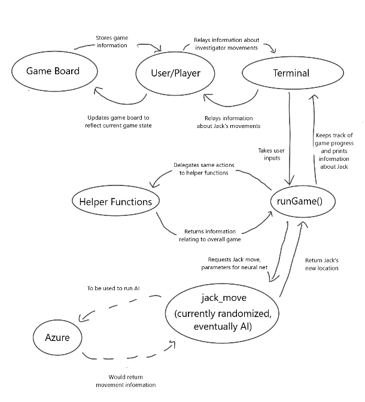

# Technical Documentation

## Abstract
The original goal of this project was to create and train an AI to play as Jack the Ripper in the board game *Whitehall Mystery*, which was created by Fantasy Flight games and originally published in 2017. That goal shifted to building the foundation of the board game, to prepare to create an AI that will eventually be able to play as Jack.

Users should be able to play the game by simply running HiddenMovement.py and then typing runGame(). Prompts will indicate when players should input their choices regarding movement and actions, while also reporting any milestones Jack has reached.

## Planning
Currently, users will need Python to use this program. It would also be helpful and desirable for users to have access to a physical copy of the game. This would allow users to input their movements into the program and then update their board to reflect any information from Jack's movements.

The goals of this project include:
- Inputting relevant data from the game board into dictionaries for use in the game.
- Implementing functions to allow the game to be played by users. At this step, Jack's movements would be random.
- Training a neural net to output Jack's movements, based on relevent data, including Jack's current location, Jack's goal for his next Discovery Location, and the locations of the investigators. Unfortunatly, this goal has not yet been accomplished.

Team:
- Emily is the sole teammate, and thus kept track of progress, updated Git, and worked on the project.
- Lucy is the mentor of this project and provided guidence throughout.

## Design
This project is built using Python. Users interact with the program through the terminal and are meant to keep track of the game's state using a physical copy of the gameboard, if available. Interaction between the user, gameboard, and HiddenMovement.py are illustrated below:  

## Implementation
The code is split into three main parts:
1. Helper functions for building the dictionaries that contain all of the information needed about the game board for the program to work, 
2. Two functions that can run the game, runGame() and runAdminGame(), which allow players and people updating the code, respectively, to play the game, and
3. Helper functions for running the game, that take care of certain aspects of game play, such as resetting variables between rounds or allowing users to take certain actions, such as "Search for Clues" or "Make an Arrest."

Currently, users interact with the code through the terminal, which will prompt them to input information such as the inspector's locations or which actions they'd like to take. The format of acceptable inputs is usually also provided, as well as some themed text.

## Conclusion
At this point, users can play a game of *Whitehall Mystery*, however they are very likely to win, as Jack currently moves randomly and is unlikely to reach the second Discovery Location in 15 turns or fewer.

There were a few obstacles that have presented themselves during the project so far:
- Inputting information into the dictionaries proved to be time consuming and repetative. The difficulty was lessened by implementing some helper functions, but there is no way to circumvent inputting data for every circle and square present on the gameboard.
- Connecting with Azure to attempt to implement a neural net also proved challenging, as well as doing so in a timely manner to attempt to complete the machine learning portion of the project sooner.
- *Whitehall Mystery* is also a complex game with a lot of rules that must be adhered to. As it's easy for users to mistype information or for players to forget about a rule, safeguards had to be implemented to ensure the rules were followed.

### Next Steps
Currently, the game can be played by users, however the main goal for the future would be to use machine learning to train an AI to play as the Jack the Ripper player for *Whitehall Mystery*. In addition to this principle goal, there are also some other interesting objectives that could be achieved:
- Implementing Special Movements for Jack
- Implementing Special Abilities for the Investigators, as included in the [rulebook](https://images-cdn.fantasyflightgames.com/filer_public/78/b4/78b4b240-ec1d-416d-8486-970fb5a941c9/whitehall_mystery_rulebook_small_copy.pdf) as an alternative way to play
- Creating a more user-friendly user interface, such as a website that could even include an interactive image of the game board
- Connecting the program with a smart-speaker, allowing users to speak their movements and continue using a physical copy of the game board, similar to how [Alexa can play Ticket to Ride](https://www.amazon.com/Days-of-Wonder-Ticket-Ride/dp/B08178MR5M)

## References
This project is based off of the [*Whitehall Mystery*](https://www.fantasyflightgames.com/en/news/2017/6/9/va102-whitehall-mystery) board game.

Mari, Gabriele, and Gianluca Santopietro. *Whitehall Mystery*. Fantasy Flight Games 2017. Board Game.